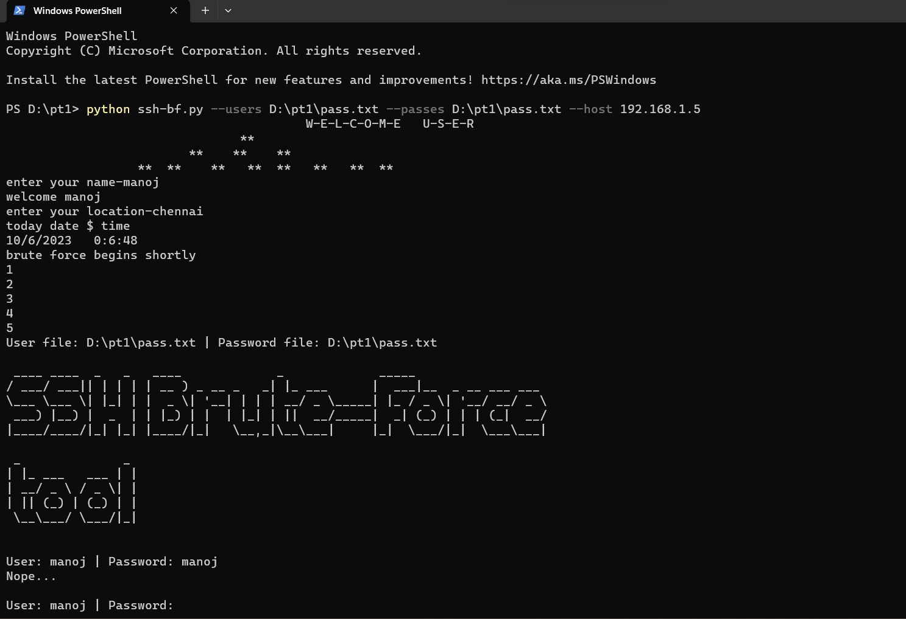
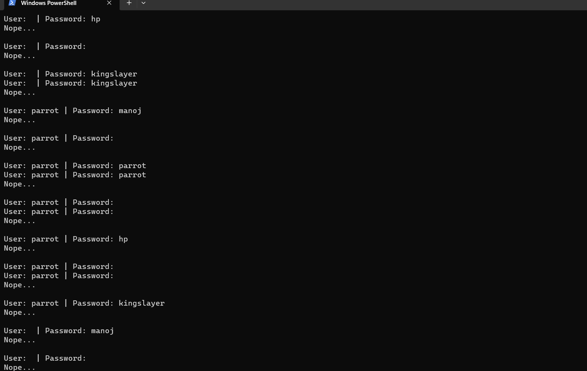
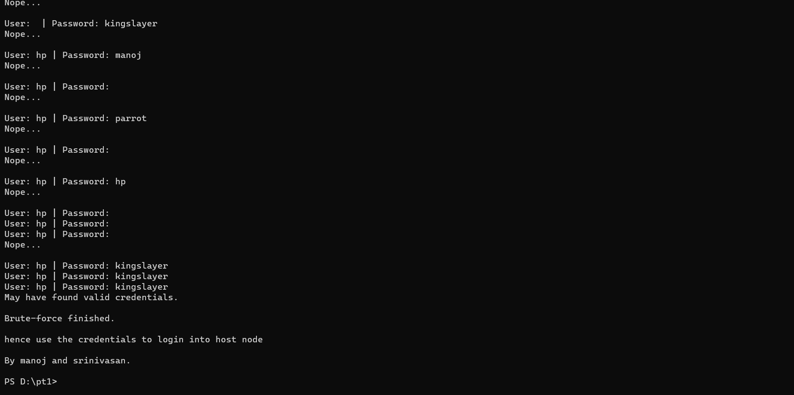

# SSH Login Using Brute Force

SSH brute force tools are used to attempt to gain unauthorized access to an SSH server by repeatedly trying different username and password combinations. These tools can be used to attack both weak and strong passwords, but they are most effective against weak ones.

> **Disclaimer:** This tool is for educational and security testing purposes only. Do not use it for unauthorized access to any system.

## Features
- Attempts login using a wordlist of usernames and passwords.
- Supports custom SSH host and port.
- Can be used by security professionals to test SSH security.

---

## Setting Up an SSH Server

### **Windows Setup**
1. Open **Settings** > **Apps** > **Optional Features**.
2. Check if **OpenSSH Client** is installed. If not, click **Add a Feature**.
3. Search for **OpenSSH Client** and install it.
4. Start **Command Prompt** as an Administrator.

### **Linux Setup**
#### **Installing SSH Client**
```bash
sudo apt install openssh-client
```
To connect to an SSH server:
```bash
ssh user@server-ip
```

#### **Setting Up SSH Server on Ubuntu**
1. Open your terminal.
2. Install OpenSSH server:
   ```bash
   sudo apt install openssh-server
   ```
3. Enable SSH server:
   ```bash
   sudo systemctl enable ssh
   ```
4. Allow SSH through the firewall:
   ```bash
   sudo ufw allow ssh
   ```
5. Now your SSH server is running!

---

## Running the SSH Brute Force Tool
To use the brute force script, run the following command in **Command Prompt (cmd)**:

```bash
python ssh-bf.py --users <path_to_user_wordlist> --passes <path_to_password_wordlist> --host <target_ip>
```

### **Example**
```bash
python ssh-bf.py --users D:\PT1\users.txt --passes D:\PT1\pass.txt --host 192.168.1.3
```

---

## Preventing SSH Brute Force Attacks
To secure your SSH server:
- **Use strong passwords** or SSH key authentication.
- **Change the default SSH port** (edit `/etc/ssh/sshd_config`).
- **Use fail2ban** to block repeated failed login attempts:
  ```bash
  sudo apt install fail2ban
  ```
- **Disable root login** by setting `PermitRootLogin no` in `/etc/ssh/sshd_config`.

---

## Screenshot



---

## License
This project is for ethical hacking and security research purposes only. Unauthorized use is strictly prohibited.

Happy Ethical Hacking! 🚀


